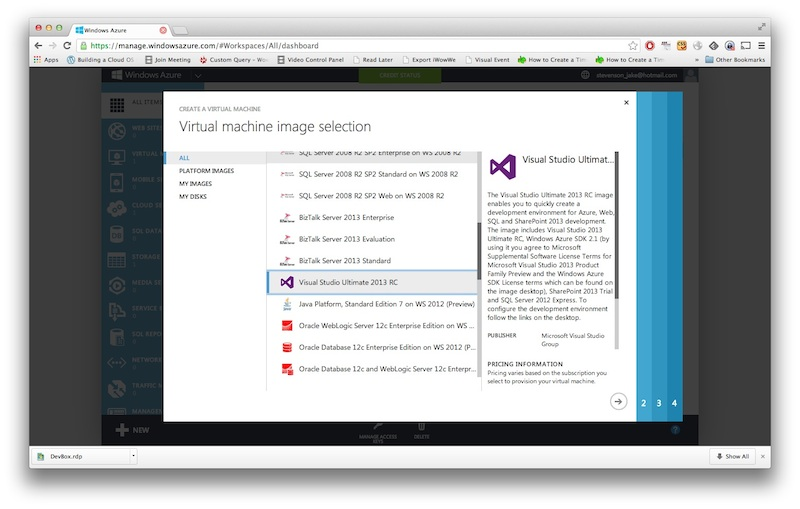
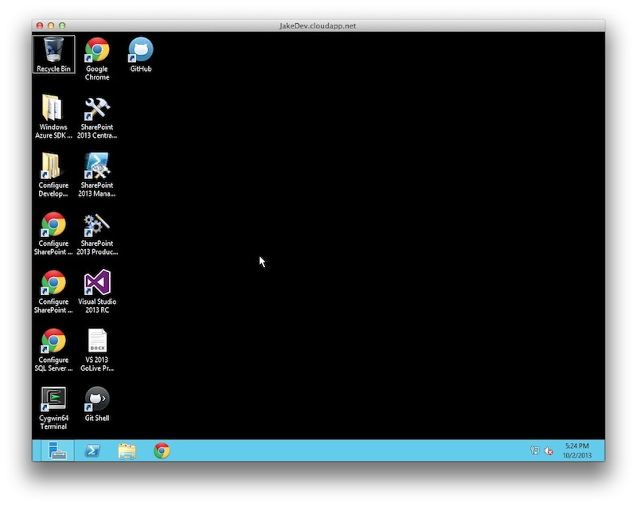

I need a new development laptop.  I prefer Macbook Pros.  But it's Oct 2nd and the highly likely rumor is that Apple will announce the new version of the MBP on October 15th. I will be VERY unhappy if the new line comes out so soon after such a major purchase, so I need to hold off and make due with something else for a while.

I have a nearly 10 year old 15" dell laptop sitting on a shelf in my office.  It has a 2G of RAM (maximum, absolutely cannot be ugraded) and god knows how old and slow of a CPU.  It currently runs Ubuntu VERY SLOWLY.  I can't imagine trying to run VS.NET 2012 on it without feeling a lot of pain.  But it IS able to run an RDP client, and that can open up all sorts of possibilities for me.

I decided I'll run my development machine **IN THE CLOUD** for a couple of weeks while I wait.  Then I can just RDP to it from any terrible machine (even my ipad!) and get some work done!  Doesn't matter where I am as long as I have internet access, and I *always* have internet access dammit.

So first, picking a cloud provider to run it.  I've used Amazon EC2 plenty in the past.  It's pretty easy to deal with.  I checked it out.  To run Windows on a decently powered "Large" VM it'll cost $.364 an hour.  They'll let you run free VMs for a year, but those are only "Micro" which equals up pretty closely with the hardware on my 10 year old laptop.  I also jumped on that free trial a long time ago and am no longer eligible.  So at $.364 and hour I'd estimate a cost of $58.24 to run it 40 hours for 4 weeks while I get all set up.  Not bad really.  

But then I saw Azure has a free trial too.  $200 free for one month.  I hadn't looked at Azure in a long time, but I keep reading about how much friendlier it has become.  So I decided to give it a shot.

Amazingly easy to set up.  Just entered my old hotmail/live/outlook.com/whatever you want to call it account name and password.  Confirmed the account and entered billing information (for when I forget to turn this thing off at the end of the month and they can hit me).  Within 5 minutes I was looking at the "portal" and ready to create a VM.

And that was easy too!  Click "+NEW" on the bottom menu and choose "Virtual Machine", then "From Gallery."  They have all sorts of nice options in here, ubuntu servers, suse servers, windows 2012, and... "Visual Studio Ultimate 2013 RC"!  Looks like it's a nice windows OS loaded up with VS.NET 2013 and all the fixings already.  Let's give it a try...

After that you enter a simple name and VM size.  I picked "Large" because it's 4 cores with 7G of memory.  Seems plenty enough for coding.  After that you set up how it will be accessed (RDP enabled by default) and some other simple stuff I forget and then it spins it up.

After about 10 minutes it's there, ready for me. I'm armed with admin credentials and I'm not afraid to use them.  Install Chrome, cygwin, github for windows, node.js.  Everything goes nice and fast.  This is great!

So that's my plan for a bit, until I'm sure my laptop purchase won't immediately become obsolete.  Development **IN THE CLOUD** free for a month.    

